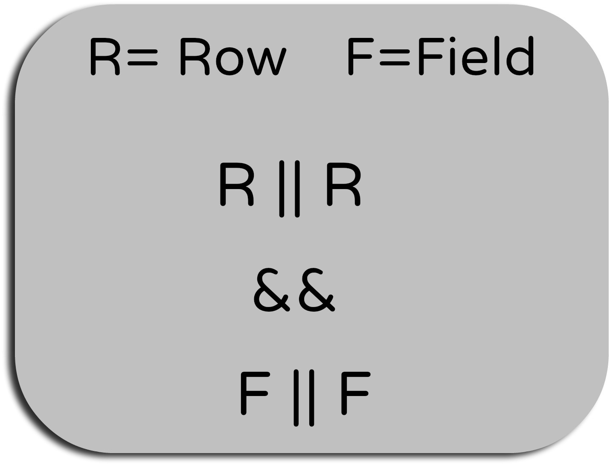

# ACL知识整理

## ACL判定逻辑

1. ServiceNow中对记录（Record）的ACL（Access Control Rule）控制分为表级（行级，Row）和字段级（Field）两类。
   * 表级之间，字段集之间如果有多条配置，那边只需要满足一条就算通过，为或（||）的关系。
   * 表级和字段级之间必须同时满足才算通过，为与（&&）的关系。
2. ACL中的*为通配符，代表所有，通常用作默认配置。特定表或者字段的ACL设定如果存在则优先使用，不存在则使用默认配置。
   * Name中如果写成task为表级ACL，写成*为表级默认（缺省）ACL，task.number为number的字段级ACL，task.*为字段级默认ACL。
   * 需要注意—None—和*是不一样的。
3. 每条ACL的设定部分主要分为Role，Condition，Script，三者需要同时满足。

## 注意事项

1. Admin overrides打勾时当前ACL对于Admin来讲将永远通过，记住是永远通过，不是无视当前ACL。
2. 如果删除表格的所有ACL设置，那么表格将不可访问。
3. ACL会继承，子表中不存在设定的话，就会使用父表的设定。
   * 需要**注意**的是，表级和字段级是分开继承的，即使子表设定了表级ACL用以覆盖父表的ACL，字段级还是会继承下来，需要小心。
4. 当Reference字段指向父表的时候，哪怕当前用户对子表有访问权限，设置的值为子表的记录时，在list界面和form界面还是会使用父表的ACL来判断，如果没有权限，相应reference字段会无法显示。
5. 修改ACL需要security_admin权限，只有拥有security_admin的用户才可以给他人security_admin权限。
   * 拥有security_admin权限后，可以点击Elevate Roles，然后再编辑ACL。

## ACL高级功能

1. 使用菜单的Debug Security可以用来调试ACL，当你打开一条记录时，记录下面会输出每一条ACL的判定以及结果。
   * 打开调试之后使用impersonate User后依旧可以看到对应用户的调试结果。
2. ACL的类型除了Record，还有其他的，这里介绍下常用的。
   * client_callable_script_include: AJAX调用中对相应的Script Include做权限控制。
   * REST_Endpoint: REST权限控制。
   * ui_page: UI Page权限控制，我们平时在内部页面使用的incident_list.do，incident.do也属于UI Page，当Record的ACL通过但依旧无法打开内部form界面时，可以看看这个有没有问题。
